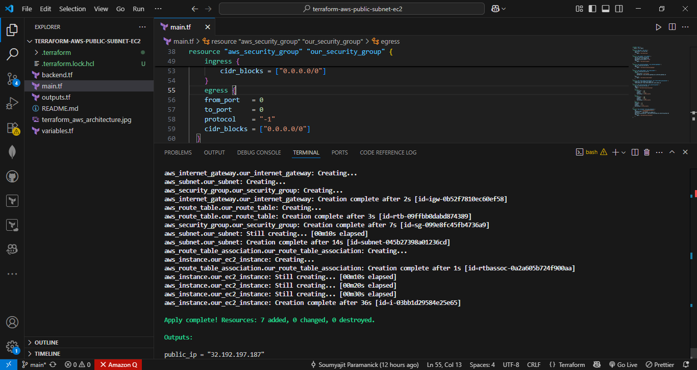
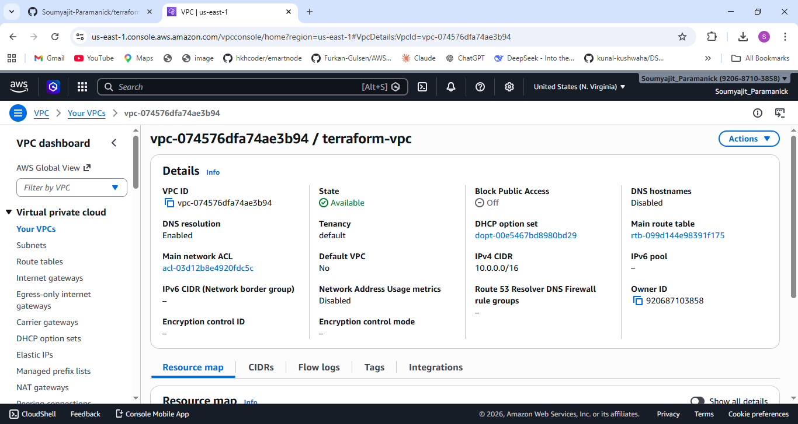
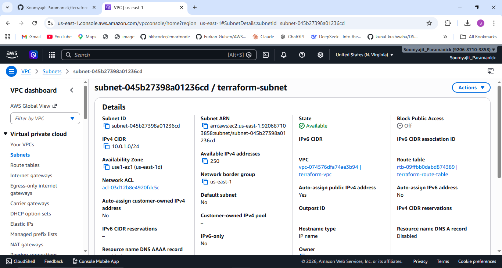
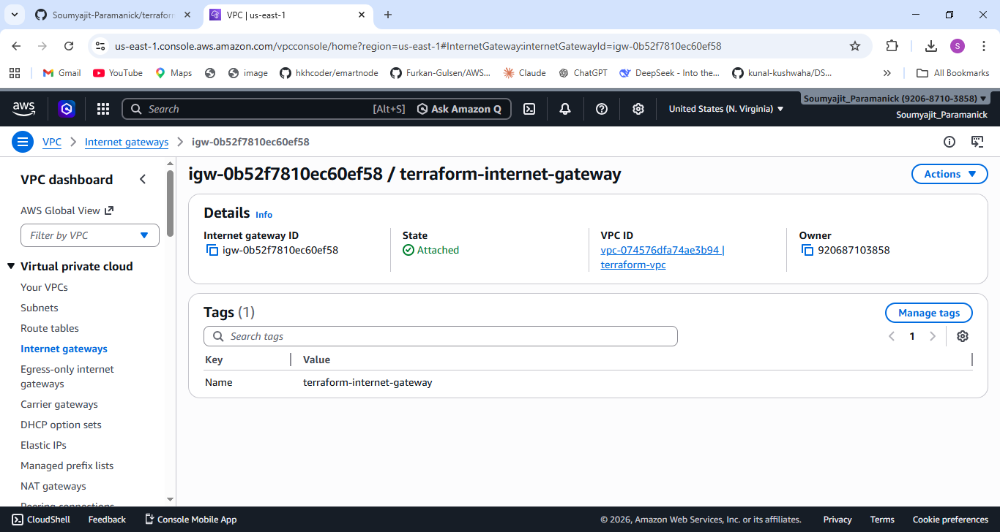
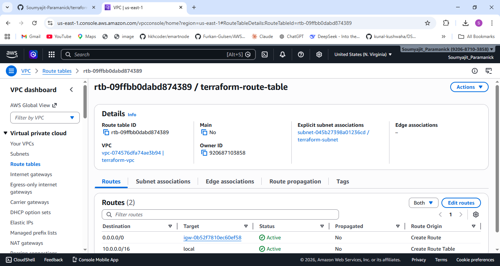
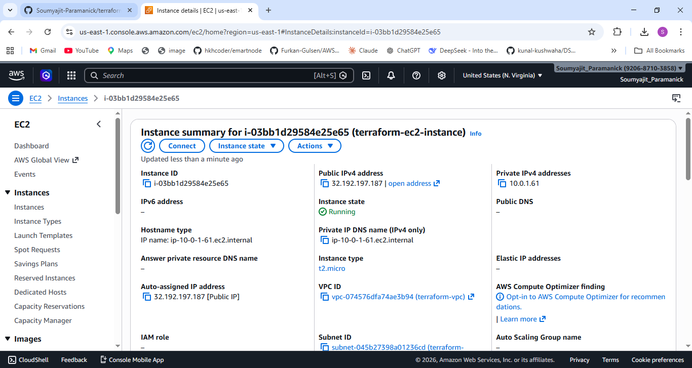

# 🚀 Terraform AWS Public Subnet EC2 Project

## 📌 Overview 
This project demonstrates how to use **Terraform (Infrastructure as Code)** to provision a complete AWS infrastructure from scratch.

The architecture includes a **custom VPC**, **public subnet**, **internet gateway**, **route table**, **security group**, and an **EC2 instance** deployed in AWS.

---

## 🧱 Architecture Diagram

<p align="center">
  
  <br/>
  <em>Figure: Terraform AWS Public Subnet EC2 Architecture</em>
</p>

---

## 🏗️ Architecture Description

This project provisions the following AWS resources:

- **VPC** (`10.0.0.0/16`)
- **Public Subnet** (`10.0.1.0/24`)
- **Internet Gateway (IGW)** attached to VPC
- **Route Table** with route `0.0.0.0/0 → IGW`
- **Route Table Association** with subnet
- **Security Group**
  - SSH (Port 22)
  - HTTP (Port 80)
- **EC2 Instance**
  - Type: `t2.micro`
  - Public IP enabled
- **S3 Backend**
  - Stores Terraform state remotely

---

## 🌐 Network Flow

```
Internet 🌍
↓
Internet Gateway
↓
Route Table (0.0.0.0/0 → IGW)
↓
Public Subnet (10.0.1.0/24)
↓
EC2 Instance
```
---

## 📸 Implementation Screenshots

### 🔹 Code Setup
<p align="center">
  
</p>

### 🔹 VPC Created
<p align="center">
  
</p>

### 🔹 Subnet Created
<p align="center">
  
</p>

### 🔹 Internet Gateway Created
<p align="center">
  
</p>

### 🔹 Route Table Created
<p align="center">
  
</p>

### 🔹 EC2 Instance Running
<p align="center">
  
</p>

---

## ⚙️ Technologies Used

- Terraform  
- AWS (EC2, VPC, S3)  
- GitHub  

---

## 📂 Project Structure


```
terraform-aws-public-subnet-ec2/
│
├── main.tf
├── variables.tf
├── outputs.tf
├── backend.tf
├── images/
│ ├── terraform_aws_architecture.jpg
│ ├── code_setup.png
│ ├── vpc_created.png
│ ├── subnet_created.png
│ ├── internet_gateway_created.png
│ ├── route_table_created.png
│ └── terraform_ec2_instance_running.png
└── README.md
```

---

## 🔐 Remote Backend (S3)

Terraform state is stored securely in an S3 bucket:

- Prevents state loss  
- Enables team collaboration  
- Supports versioning  

---

## 🚀 How to Run This Project

### 1️⃣ Initialize Terraform
```bash
terraform init
```
### 2️⃣ Preview Changes
```bash
terraform plan
```
### 3️⃣ Apply Configuration
```bash
terraform apply
```
### 4️⃣ Destroy Resources
```bash
terraform destroy
```
## ⚠️ Important Notes
Ensure AWS CLI is configured:
```bash
aws configure
```
Do NOT make your S3 bucket public (Terraform state is sensitive)
Always run terraform destroy after testing to avoid unnecessary costs
## 💰 Cost Consideration
Uses t2.micro (Free Tier eligible)
VPC components are free
S3 cost is minimal (few KB)
## 🧠 Key Learnings
Infrastructure as Code using Terraform
AWS networking fundamentals (VPC, subnet, IGW)
Public subnet configuration
Security group rules
Remote state management using S3
## 🎯 Future Improvements
Add Private Subnet
Implement NAT Gateway
Add Load Balancer
Use Terraform Modules
Add CI/CD pipeline
## 🙌 Author

Soumyajit Paramanick